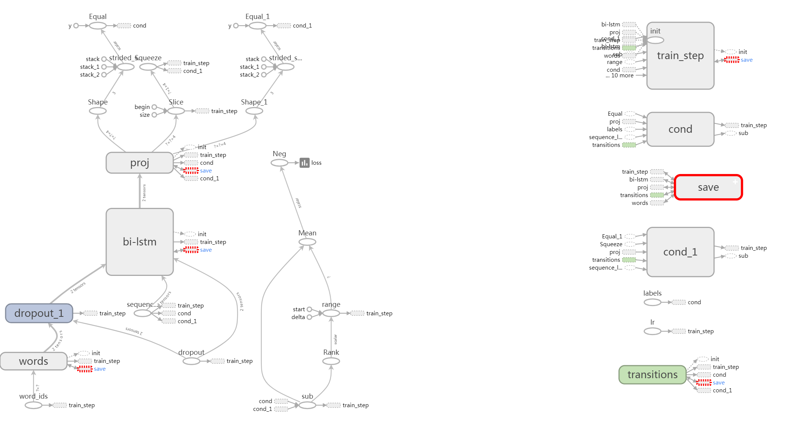

## A simple BiLSTM-CRF model for NER
识别会计领域的实体（下次把计算机方向的加上）  
This code works on __Python 3 & TensorFlow 1.2__ 

### 模型架构图如下：

对于每一个输入的中文语句，语句中的每个字都会对应于集合{O，B-Acc，M-Acc，E-Acc}中的一个tag。

模型的第一个layer (__look-up layer__)，用于将字的one-hot向量表示转化为 *character embedding（词嵌入）* 。在本模型实现中，并没有提前训练好Word2vec向量模型对字进行初始化，而仅仅是简单的随机初始化，此处是以后待改进的一个地方。

模型的第二个layer (__BiLSTM layer__)，双向的lstm模型能有效地利用 *past and future（过去和未来）* 的信息，自动提取特征。

模型的第三个layer (__CRF layer__)， 对每句话中的标签进行标注。如果我们用 __Softmax layer__ 进行标注，我们将得到无语法结构的标注答案， 因为 softmax 无法独立地对每个位置进行标注。

### Tensorflow 模型图如下：   

### train

`python main.py --mode=train `

### test

`python main.py --mode=test --demo_model=1521112368`

### demo

`python main.py --mode=demo --demo_model=1521112368`

